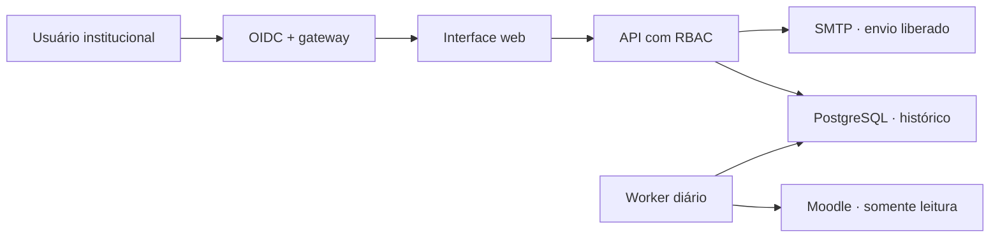

# Arquitetura e segurança

## Fluxo

O navegador nunca consulta o Moodle nem escolhe sua própria permissão. A API recebe identidade validada pelo gateway, aplica o escopo cadastrado no servidor e trabalha sobre a última fotografia imutável.

## Componentes

| Componente | Responsabilidade | Limite de confiança |
|---|---|---|
| OAuth2 Proxy | Login OIDC e domínio institucional | Não decide papel ou cursos |
| Nginx | Interface, cabeçalhos e proxy interno | Injeta segredo compartilhado apenas para a API |
| API | Sessão, CSRF, RBAC, filtros e relatórios | Autoridade sobre perfil, escopo e destinatários |
| Worker | Consulta Moodle e gera fotografias | Credencial SQL somente leitura |
| PostgreSQL | Fotografias, envios e auditoria | Não fica exposto na rede do servidor |
| SMTP | Entrega do relatório homologado | Desativado por padrão |

## Modelo de verdade

1. Worker consulta cursos na categoria raiz e subcategorias.
2. Docentes são obtidos pelas atribuições do papel configurado.
3. Atividades são classificadas conforme catálogo versionado.
4. Estado atual define se a estrutura está pronta.
5. Prazo vem exclusivamente do catálogo oficial.
6. Fotografia pronta antes do prazo comprova entrega no prazo.
7. Fotografia pendente após o prazo, seguida de pronta, comprova atraso.
8. Logs acrescentam interação; nunca definem a data de entrega.
9. Uma fotografia recebe ID único e não é alterada.
10. Dashboard e e-mail leem a mesma fotografia.

Chave de resultado: `snapshot_id + course_id + teacher_id + requirement_id`.

## Disciplina restaurada

A estrutura vira `INHERITED_READY` apenas quando todas as condições são verdadeiras:

- Moodle informa curso de origem;
- restauração ocorreu antes da atribuição do docente;
- todos os requisitos atuais estão visíveis;
- quantidades exigidas estão completas;
- mapeamento não é ambíguo.

Isso isenta a entrega da estrutura. O acesso do docente continua independente e pode ficar crítico.

## Evento de Tarefa

| Evento | Uso |
|---|---|
| `course_module_updated` | Apoia autoria/data; estado atual ainda decide |
| `course_module_completion_updated` | Interação/acesso; nunca prova entrega |
| `course_module_viewed` | Interação/acesso; nunca prova entrega |
| Evento desconhecido | Contexto; não altera situação |

## Controles aplicados

- Cookie de sessão `HttpOnly + Secure + SameSite=Strict`.
- CSRF e origem exata em qualquer mutação.
- Papéis e cursos definidos em variável protegida no servidor.
- TLS verificado no SQL Server; `trustServerCertificate=false`.
- Consulta `READ COMMITTED`, sem `NOLOCK`.
- Limite de conexões e tempo máximo de consulta.
- E-mail com idempotência por fotografia, público e destinatário.
- Dados demonstrativos não podem ser enviados.
- Falha crítica de qualidade bloqueia publicação.
- Contêineres sem privilégios, com sistema de arquivos somente leitura onde possível.

## Privacidade

O sistema usa nome, e-mail institucional e atividade de acesso. Antes da produção, a UNIFENAS deve registrar finalidade, responsáveis, prazo de retenção e processo de atendimento ao titular conforme suas políticas e a LGPD. Evite exportações locais e não inclua dados de estudantes.

## Limites do piloto

- Prazos oficiais ainda não preenchidos.
- Regras ainda marcadas como piloto.
- Mapeamento dos campos personalizados do Moodle depende de conferência no banco real.
- Metadados OIDC e escopos reais dependem da TI.
- Envio automático depende de homologação e decisão do dia/horário.
